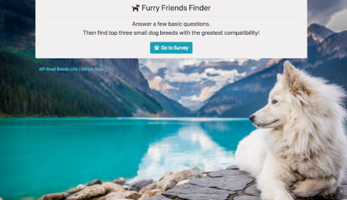
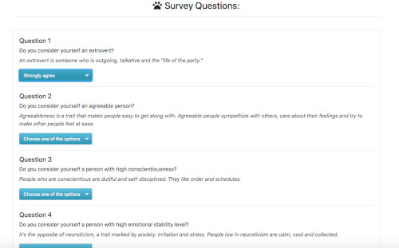

# FurryFriendFinder
### by Halina Z

#### Description
_________________________________________________________________

This full-stack application finds three top mathing small breeds of dogs based on a user's answers to five survey questions. 
The app displays the breeds and the images of these best matching small breeds. The app uses Express to handle routing.

_________________________________________________________________

#### Home page: 

The home page has a "Go to Survey" button to open a survey page, and also has a link to the small breeds api which displays a JSON of nine small breeds of dogs.

_________________________________________________________________

#### Survey page: 

The survey page contains a form with five basic questions about a user personality traits. After the questions are answered and the button "Submit" is clicked, the top three matches are displayed in the modal dialog. 

